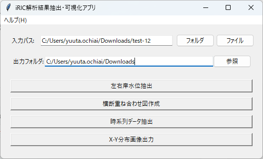

# iRIC_DataScope
iRIC の計算結果を解析・抽出・可視化する GUI ツールです。



- 時系列データ抽出
- 横断断面の重ね合わせ
- 左右岸最大水位の整理
- ステップ別 X-Y 分布画像出力（Value をカラーマップ表示）
- 入力が **プロジェクトフォルダ / .ipro** の場合も、3機能は直接読み込んで処理を継続

## 必要環境
- Python 3.13
- uv（任意）

## セットアップ
### uv を使う場合
```bash
uv sync
```

### uv を使わない場合
```bash
pip install -r requirements.txt
```

## 使い方
### 推奨（uv）
```bash
uv run python -m iRIC_DataScope.app
```

### uv を使わない場合
```bash
python -m iRIC_DataScope.app
```

## 実行ファイル
利用者向けの exe は Releases にあります。  
https://github.com/Pckk-solvers/iRIC_DataScope/releases

## ドキュメント

### ユーザーマニュアル（GitHub Pages）
最新のドキュメントは GitHub Pages でホストされています：  
https://pckk-solvers.github.io/iRIC_DataScope/

### ローカルでドキュメントをビルドする場合
ローカルでドキュメントをビルドして参照する場合：

```bash
# ドキュメントビルド
mkdocs build

# ローカルサーバーで閲覧
mkdocs serve
```

ビルド済みドキュメントは `build_docs/site/index.html` からアクセスできます。

### Webマニュアル（Notion）こちらは旧バージョンとなります。
入力選択〜出力までの画面操作を機能別にまとめています。  
https://trite-entrance-e6b.notion.site/iRIC_tools-1f4ed1e8e79f8084bf81e7cf1b960727?pvs=73

## 主要構成
```
iRIC_DataScope/
├── iRIC_DataScope/          # メインパッケージ
│   ├── app.py               # エントリポイント
│   ├── common/              # 共通機能（プロジェクト→CSV 変換含む）
│   ├── cross_section/       # 横断重ね合わせ
│   ├── lr_wse/              # 左右岸最大水位整理
│   ├── time_series/         # 時系列抽出
│   └── xy_value_map/        # ステップ別 X-Y 分布画像出力
├── requirements.txt
├── sample_config/
└── docs/
```

## ライセンス
[MIT ライセンス](LICENSE)
