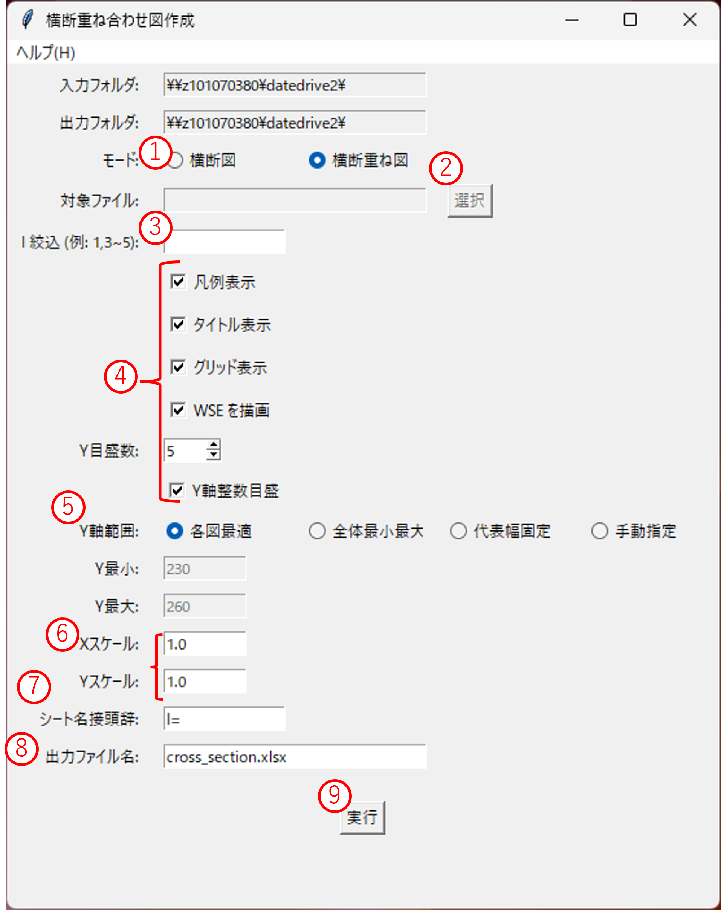
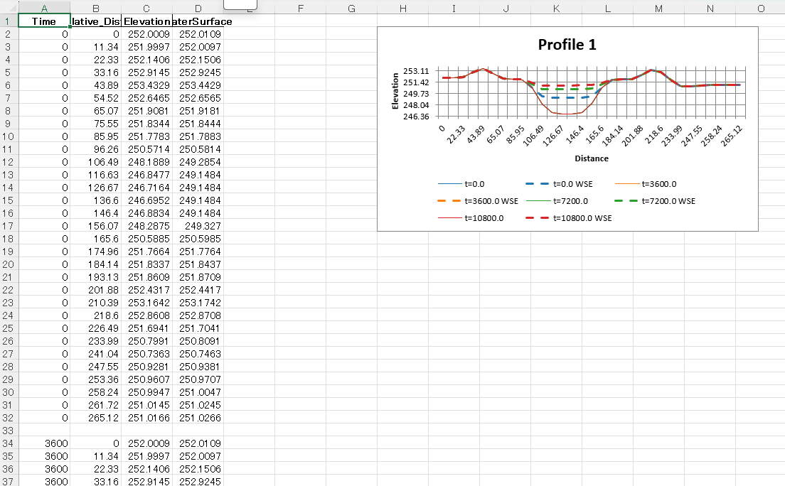

# 横断重ね合わせ図作成

横断方向のプロファイルを作成し、複数ステップの結果を重ね合わせて可視化する GUI ツールです。

---

## 対象と前提

| 項目 | 内容 |
| ---- | ---- |
| 入力 | ランチャーで指定した **プロジェクトフォルダ / `.ipro` / CSV フォルダ（`Result_*.csv`）** |
| 出力 | Excel ファイル（各プロファイルをシートに格納） |
| 対象データ | CSV 内の X, Y, ZB, WSE などの列を利用 |

> **注意**: CSV フォルダ入力の場合、必要な列が `Result_*.csv` に存在する必要があります。

---

## 画面構成（概要）

1. **入力/出力設定**  
   - 入力フォルダと出力フォルダを表示（ランチャーで指定済み）

2. **モード選択**  
   - **横断図**: 単一ファイルのプロファイルを作成  
   - **横断重ね図**: 複数ステップを重ね合わせたプロファイルを作成

3. **対象設定**  
   - **I 絞込**: 対象とする Profile_ID を指定（例: `1,3~5`）  
     - 本ツールでは **I（Profile_ID）= 横断の識別子** として扱います。
   - **対象ファイル**: **横断図**（単体）モード時に CSV ファイルを直接選択

4. **グラフオプション**  
   - 凡例表示、タイトル表示、グリッド表示、WSE 描画の ON/OFF  
   - Y目盛数、Y軸整数目盛の設定

5. **Y軸範囲設定**  
   - **各図最適**: 各プロファイルで最適な範囲を自動設定  
   - **全体最小最大**: 全データの最小値・最大値で統一  
   - **代表幅固定**: 代表的な幅で固定  
   - **手動指定**: 最小値・最大値を直接入力

6. **スケール設定**  
   - X スケール、Y スケールで拡大率を指定

7. **出力設定**  
   - **シート名接頭辞**: Excel シート名の接頭辞（例: `I=`）  
   - **出力ファイル名**: 出力する Excel ファイル名

---

## 基本ワークフロー

1. **モードを選択**  
   `横断図` または `横断重ね図` を選択します。

2. **対象を指定**  
   - I 絞込に処理対象の Profile_ID を入力（例: `1,3~5`）  
   - **横断図**（単体）モード時は「選択」ボタンで対象 CSV ファイルを選択

3. **グラフオプションを設定**  
   - 必要に応じて凡例、タイトル、グリッド、WSE の表示/非表示を切り替え

4. **Y軸範囲を設定**  
   - 用途に応じて Y 軸範囲モードを選択  
   - `手動指定` の場合は Y 最小値・最大値を入力

5. **スケールを調整**  
   - X スケール、Y スケールでグラフの拡大率を設定

6. **出力設定を確認**  
   - シート名接頭辞と出力ファイル名を確認

7. **実行**  
   `実行` ボタンで処理を開始します。出力先に Excel ファイルが生成されます。

---

## 出力詳細

### Excel ファイル構成
- 各プロファイルが別シートとして格納
- シート名: `[接頭辞][Profile_ID]`（例: `I=1`, `I=2`）
- グラフは画像としてシートに埋め込み

---

### Y軸範囲モードの動作
| モード | 説明 |
| ---- | ---- |
| 各図最適 | 各プロファイルのデータ範囲で Y 軸を自動設定 |
| 全体最小最大 | 全プロファイルの最小値・最大値で統一 |
| 代表幅固定 | 代表的な水位幅で固定（例: 230-260m） |
| 手動指定 | ユーザーが指定した最小値・最大値を使用 |

---

## よくあるエラーと対処

| 症状 | 原因 / 対処 |
| ---- | ---- |
| 「対象ファイルが見つかりません」 | single モードでファイル選択が未了、またはファイルパスが不正 |
| 「Profile_ID に該当するデータがありません」 | I 絞込の指定がデータ範囲外、または CSV に該当 ID が不存在 |
| 「必要な列が見つかりません」 | CSV ファイルに X, Y, ZB などの必要な列が存在しない |
| Excel 出力でエラー | 出力フォルダの書き込み権限がない、またはファイルが開かれている |

---

## 参考情報

- 仕様書: [`docs/specs/cross_section.md`](../specs/cross_section.md)
