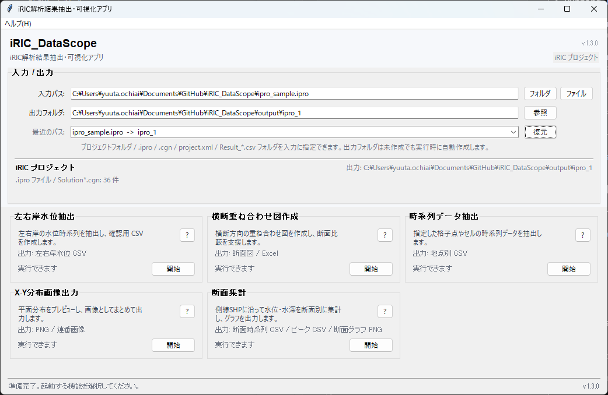

# ランチャー（起動ウィンドウ）

入力パス（プロジェクトフォルダ / CSV フォルダ / `.ipro` / `.cgn` / `project.xml`）と出力フォルダを指定し、各機能（別ウィンドウ）を起動するための入口です。

---

## 入力
- **入力パス（フォルダ / `.ipro` / `.cgn` / `project.xml`）** を 1つ指定します。
  - フォルダ指定の場合:
    - **プロジェクトフォルダ**（推奨）: `Case1.cgn` / `Solution*.cgn` が含まれるフォルダ
    - **CSV フォルダ**: iRIC 出力の `Result_*.csv` が入っているフォルダ
  - ファイル指定の場合:
    - **`.ipro`**: iRIC のプロジェクトファイル
    - **`.cgn`**: CGNS ファイル
    - **`project.xml`**: iRIC プロジェクトのメタファイル。親フォルダをプロジェクトとして扱います。

> 補足: 画面上は「フォルダ」「ファイル」ボタンで切り替えて選択します（指定できるのは常に 1つです）。

## 出力
- 出力フォルダは、各機能が生成するファイルの保存先として使われます。
- 存在しないフォルダを指定した場合は、機能起動時に自動作成されます。

---

## 使い方（最短）
1. 「入力パス」でプロジェクトフォルダ / `.ipro` / `.cgn` / `project.xml` / CSV フォルダを選択
2. 「出力フォルダ」で保存先を選択
3. 入力診断で、入力種別と検出ファイル数を確認
4. 実行したい機能カードの「開始」を押す

---

## 画面の見方
- **入力診断**: 入力パスを自動判定し、基準CGNS / `Solution*.cgn` / `Result_*.csv` の検出状況を表示します。
- **最近使ったパス**: 直近で起動した入力パスと出力フォルダの組み合わせを復元できます。
- **機能カード**: 各機能の概要、主な出力、起動状態を表示します。
- **? ボタン**: 該当機能のユーザーマニュアルを開きます。

---

## ヘルプ
- **Notion**: メニュー **ヘルプ → マニュアルを開く (Notion)**  
  - [iRIC tools Manual](https://trite-entrance-e6b.notion.site/iRIC_tools-1f4ed1e8e79f8084bf81e7cf1b960727?pvs=73)
- **GitHub Pages**: メニュー **ヘルプ → ユーザーマニュアルを開く (GitHub Pages)**  
  - [iRIC_DataScope Docs](https://pckk-solvers.github.io/iRIC_DataScope/)

---

## 補足
- ランチャーは、入力を自動変換（CSV 化）してから起動する方式ではありません。各機能が入力を直接読み込みます。
