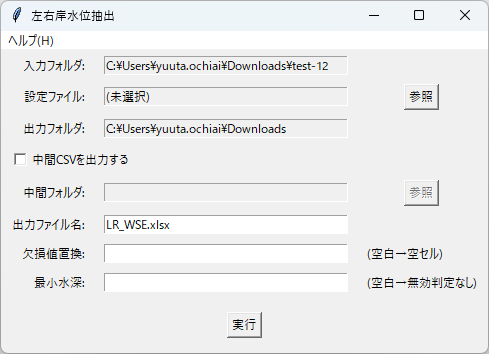
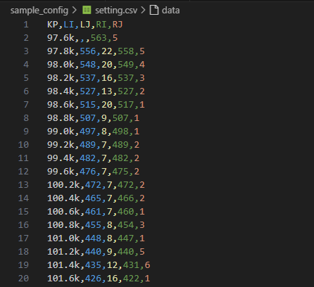
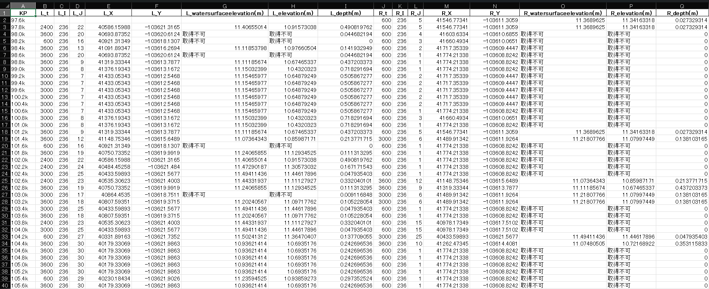

# 左右岸水位抽出

設定（KP と左右岸の I/J 指定）に基づいて左右岸の水位等を抽出し、KP ごとの最大水位を Excel に整理して出力する GUI ツールです。



---

## 対象と前提

| 項目 | 内容 |
| ---- | ---- |
| 入力 | ランチャーで指定した **プロジェクトフォルダ / `.ipro` / CSV フォルダ（`Result_*.csv`）** |
| 設定ファイル | **必須**。KP と左右岸の I/J を指定した CSV ファイル |
| 出力 | Excel ファイル（例: `LR_WSE.xlsx`） |
| 対象データ | `watersurfaceelevation(m)` / `elevation(m)`（最小水深使用時は `depth(m)` も必須） |

> **注意**: 設定ファイルの `LI/LJ/RI/RJ` は数値として解釈できる形式である必要があります（例: `12`, `12.0`）。

---

## 画面構成（概要）

1. **入力/出力設定**  
   - 入力フォルダと出力フォルダを表示（ランチャーで指定済み）

2. **設定ファイル選択**  
   - 「参照」ボタンで設定 CSV ファイルを選択  
   - 選択されたファイルパスを表示

3. **中間 CSV 出力オプション**  
   - **中間CSVを出力する**: チェックで ON/OFF  
   - **中間フォルダ**: 中間 CSV の出力先（自動設定）

4. **出力設定**  
   - **出力ファイル名**: Excel ファイル名を指定（例: `LR_WSE.xlsx`）

5. **欠損値置換**  
   - 欠損値の代替文字列を指定（空白で空セル）

6. **最小水深**  
   - `depth(m)` が **入力値以下** の場合、その岸の出力を **"取得不可"** に置換  
   - 空欄の場合は判定を行いません

7. **実行ボタン**  
   - 設定内容で左右岸水位抽出を実行

---

## 基本ワークフロー

1. **設定ファイルを準備**  
   KP と左右岸の I/J を指定した CSV ファイルを作成

2. **設定ファイルを選択**  
   「参照」ボタンで設定 CSV ファイルを選択

3. **出力設定を確認**  
   - 出力ファイル名を確認（必要なら変更）
   - 中間 CSV 出力が必要ならチェック

4. **欠損値 / 最小水深を設定**  
   - 欠損値置換（必要なら）  
   - 最小水深（必要なら）

5. **実行**  
   「実行」ボタンで処理を開始します。出力先に Excel ファイルが生成されます。

---

## 設定ファイルの形式



### 必須列
| 列名 | 説明 | 例 |
| ---- | ---- | ---- |
| KP | 河川距離 | 0.0, 100.0, 200.0 |
| LI | 左岸 I インデックス | 12, 13, 14 |
| LJ | 左岸 J インデックス | 5, 5, 5 |
| RI | 右岸 I インデックス | 8, 9, 10 |
| RJ | 右岸 J インデックス | 5, 5, 5 |

### 設定 CSV の例
```csv
KP,LI,LJ,RI,RJ
0.0,12,5,8,5
100.0,13,5,9,5
200.0,14,5,10,5
```

> KP は `97.6k` のような末尾 `k/K` 付きでも読み込めます（数値部分だけで並べ替えを行います。単位換算はしません）。

---

## 出力詳細



### Excel ファイル構成
- **Summary シート**: KP ごとの最大水位を整理
- 列順は `t / I / J / X / Y / 水位 / 標高 / depth` の順で左右岸を並べます

### 中間 CSV 出力
- 有効時: 出力フォルダ配下に `Excel名` のサブフォルダを作成
- 各ステップの左右岸水位データを CSV として保存

### 抽出ルール
- `t=0` の時系列は抽出対象から除外します
- 各 KP で **左右岸それぞれ最大水位の行**を採用します
- 最小水深が指定された場合、`depth(m) <= 最小水深` の岸は **"取得不可"** に置換

### 欠損値置換と「取得不可」の優先順位
- 欠損値置換（`NaN` → 代替文字列/空セル）を行ったあとに、最小水深に該当する岸は **"取得不可"** で上書きされます。
  - つまり、最小水深の判定が最優先です。

---

## よくあるエラーと対処

| 症状 | 原因 / 対処 |
| ---- | ---- |
| 「設定ファイルが選択されていません」 | 「参照」ボタンで設定 CSV ファイルを選択 |
| 「設定ファイルの形式が不正です」 | CSV に KP, LI, LJ, RI, RJ 列が存在するか確認 |
| 「LI/LJ/RI/RJ は数値として解釈できません」 | 該当列が数値形式（例: 12, 12.0）であることを確認 |
| 「depth(m) 列が存在しません」 | 最小水深を使う場合、入力に `depth(m)` が必要 |
| Excel 出力でエラー | 出力フォルダの書き込み権限がない、またはファイルが開かれている |

---

## 参考情報

- 仕様書: [`docs/specs/lr_wse.md`](../specs/lr_wse.md)
