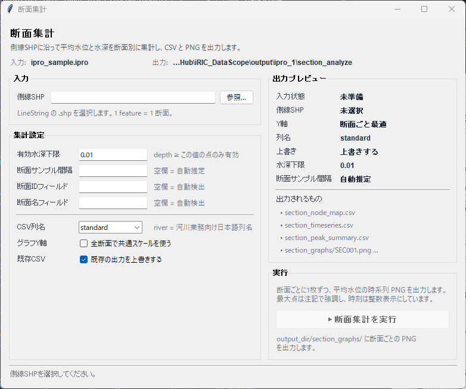

# 断面集計

側線SHPに沿って平均水位と水深を断面別に集計し、CSV とグラフ PNG を出力する GUI ツールです。

---

## 対象と前提

| 項目 | 内容 |
| ---- | ---- |
| 入力 | ランチャーで指定した **プロジェクトフォルダ / `.ipro` / `.cgn` / `project.xml`** |
| 側線SHP | **必須**。LineString の `.shp`。1 feature を 1 断面として扱います |
| 出力 | 断面対応表 CSV、時系列 CSV、ピーク一覧 CSV、断面グラフ PNG |
| 対象データ | `watersurfaceelevation(m)` / `depth(m)` のノード値 |

> **注意**: 側線SHP と CGNS は同じ平面座標系である前提です。

---

## 画面構成（概要）

1. **入力**
   - 側線SHPを選択します。

2. **集計設定**
   - **有効水深下限**: この値以上の水深を持つ点だけを集計対象にします。
   - **断面サンプル間隔**: 側線上のサンプリング間隔です。空欄なら自動推定します。
   - **断面IDフィールド / 断面名フィールド**: SHP属性候補から選択します（`(自動)` 可）。

3. **グラフ設定**
   - **グラフY軸**: 断面ごと最適、または全断面共通スケールを選べます。
   - **横軸目盛間隔[h]**: 空欄なら自動目盛、入力時は固定刻みです。
   - **タイトル形式**: `{section_id}` と `{section_name}` を使ってタイトルを指定できます。
   - **グラフ幅[inch] / グラフ高さ[inch] / 解像度DPI**: 出力PNGのサイズと解像度を調整できます。

4. **出力設定**
   - **CSV列名**: `standard` または `river` を選択します。
   - **既存CSV**: 上書き可否を切り替えます。

5. **出力プレビュー**
   - 実行前に、現在の設定でどの出力が作られるかを確認できます。

6. **実行**
   - **断面集計を実行**: 全断面を処理します。
   - **1断面プレビュー**: 1断面のみ先に出力し、プレビューウィンドウで見た目を確認できます。
   - プレビューウィンドウ内の **この設定で全断面を実行** から本実行へ移行できます。

---

## 基本ワークフロー

1. 側線SHPを選択します。
2. 必要に応じて有効水深下限、断面サンプル間隔、属性名を設定します。
3. グラフ設定（軸目盛、タイトル、サイズ、DPI）を必要に応じて調整します。
4. まず `1断面プレビュー` で見た目を確認します（任意）。
5. 出力プレビューを確認し、`断面集計を実行` を押します。

---

## 出力されるもの

`section_node_map.csv`: 各断面で採用した格子点の対応表です。  
`section_timeseries.csv`: 各断面の各時刻における平均水位・平均水深などの時系列集計結果です。  
`section_peak_summary.csv`: 各断面で平均水位が最大となった時刻と、その時の代表値を抜き出した一覧です。  
`section_graphs/SECxxx.png`: 断面ごとの平均水位時系列グラフで、横軸が時刻、縦軸が平均水位、最大点を注記で強調した確認用画像です。

---

## グラフの見方

- タイトルは `断面ID 断面名 / 平均水位時系列` です。
- 横軸は時間[h]、縦軸は水位[T.P.m]です。
- 最大点には値と時刻の注記が付きます。
- 既定では断面ごとに見やすい Y 軸範囲を使います。
- 比較を重視する場合は **全断面で共通スケールを使う** を有効にします。

---

## よくあるエラーと対処

| 症状 | 原因 / 対処 |
| ---- | ---- |
| 「側線SHPが見つかりません」 | SHP のパスを再確認 |
| 断面ごとに値が出ない | 側線位置が計算格子から離れている、または有効水深下限が高すぎる可能性があります |
| グラフが平坦に見える | 全断面共通スケールになっている可能性があります |
| 出力済みファイルでエラー | 上書き設定を確認 |

---

## 参考情報

- 開発向け要件: [`docs/dev_docs/section_analyze/requirements.md`](../dev_docs/section_analyze/requirements.md)
