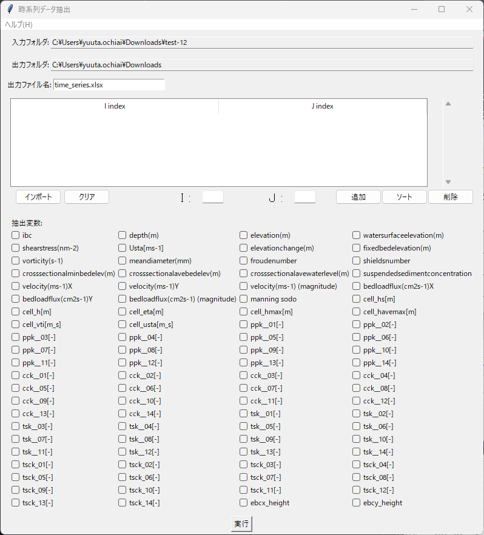
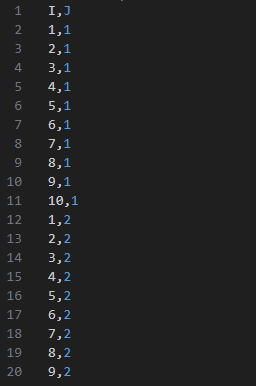

# 時系列データ抽出

指定した地点（格子点）に対して、複数ステップの値を集計し、Excel に時系列として出力する GUI ツールです。



---

## 対象と前提

| 項目 | 内容 |
| ---- | ---- |
| 入力 | ランチャーで指定した **プロジェクトフォルダ / `.ipro` / CSV フォルダ（`Result_*.csv`）** |
| 出力 | Excel ファイル（各地点・変数の時系列データをシートに格納） |
| 対象データ | 格子点 (I, J) と変数（列）の時系列値 |

> **注意**: 変数一覧は、入力がプロジェクトフォルダ / `.ipro` の場合は CGNS から、CSV フォルダの場合は CSV の列から取得します。

---

## 画面構成（概要）

1. **入力/出力設定**  
   - 入力フォルダと出力フォルダを表示（ランチャーで指定済み）

2. **格子点選択**  
   - **格子点テーブル**: I, J インデックスの一覧を表示  
   - **個別追加**: I, J を入力して「追加」ボタンで地点を追加  
   - **一括インポート**: 設定 CSV ファイルから I, J 列を読み込み  
   - **編集操作**: 「ソート」「削除」「クリア」で地点リストを管理

3. **変数選択**  
   - 利用可能な変数（列）をチェックボックスで選択  
   - 複数の変数を同時に選択可能

4. **実行ボタン**  
   - 設定内容で時系列データ抽出を実行

---

## 基本ワークフロー

1. **格子点を設定**  
   - 個別入力: I, J を入力して「追加」  
   - 一括設定: 「インポート」で設定 CSV から読み込み（例: I, J 列を持つ CSV）

2. **変数を選択**  
   抽出したい変数にチェックを入れます（例: ZB, U, V, HS など）

3. **地点リストを確認**  
   - 「ソート」で I, J 順に整理  
   - 不要な地点は選択して「削除」

4. **実行**  
   「実行」ボタンで処理を開始します。出力先に Excel ファイルが生成されます。

---

## 格子点設定方法

### 個別入力
1. I, J の値をそれぞれ入力フィールドに入力
2. 「追加」ボタンでテーブルに追加
3. 必要なだけ繰り返し

### 一括インポート
1. 「インポート」ボタンをクリック
2. I, J 列を含む CSV ファイルを選択
3. 自動的に全地点がテーブルに追加

### 設定 CSV の形式
```
I,J
1,5
2,5
3,5
```

---

## 設定 CSV の例（I, J）




---

## 出力詳細

### Excel ファイル構成
- 各変数が別シートとして格納
- シート名: 変数名（例: `ZB`, `U`, `V`）
- 行: ステップ番号
- 列: 格子点（例: `I1_J5`, `I2_J5`）

### データ形式
- 時系列データ: ステップごとの値変化を記録
- 欠損値: 該当格子点にデータがない場合は空白

---

## よくあるエラーと対処

| 症状 | 原因 / 対処 |
| ---- | ---- |
| 「格子点が設定されていません」 | I, J を追加するか、設定 CSV をインポート |
| 「変数が選択されていません」 | 少なくとも1つの変数にチェックを入れる |
| 「I, J は整数で入力してください」 | I, J は整数値で入力（小数点不可） |
| 「設定 CSV の読み込みに失敗しました」 | CSV に I, J 列が存在するか確認 |
| Excel 出力でエラー | 出力フォルダの書き込み権限がない、またはファイルが開かれている |

---

## 参考情報

- 仕様書: [`docs/specs/time_series.md`](../specs/time_series.md)
